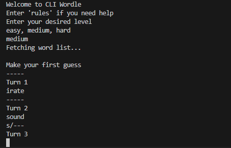

# Wordle CLI

A console-based Wordle game, featuring a self-made word list API and caching.
The first time selecting difficulty will probably take a moment, because the API is hosted on a free plan and spins down.

## Table of Contents

- [Tech Stack](#tech-stack)
- [Preview](#preview)
- [How It Works](#how-it-works)
- [Installation](#installation)
- [Usage](#usage)
- [License](#license)
- [Contact](#contact)

## Tech Stack

 - **Python**: Scripting language
 - **Flask**: Module for web services, used to build API

## Preview



## How It Works

The CLI runs on a main game loop which requests the user to determine their difficulty level. The input becomes the endpoint to request the API I created in api.py which is hosted on Render.

Each time a new difficulty is requested, the game will create a local cache of the word list from the API to avoid unnecessary API requests.

The game then asks for user input and returns a string to show which guesses were correct or in the word but not the right place.

It keeps track of turns to help avoid using up a turn when entering inputs that aren't exactly 5 letters.

## Installation

Clone Repository
```bash
cd desired directory
```

```bash
git clone https://github.com/nathanialwm/WordleCLI.git
```
Optionally create a .venv


Install dependencies
```bash
pip install -r requirements.txt
```

## Usage

Navigate to directory
```bash
python main.py
```

Or, run it in your code editor

## License

Unlicensed

## Contact

Nathanial Martin @ [Linkedin](https://www.linkedin.com/in/nathanialm/)
